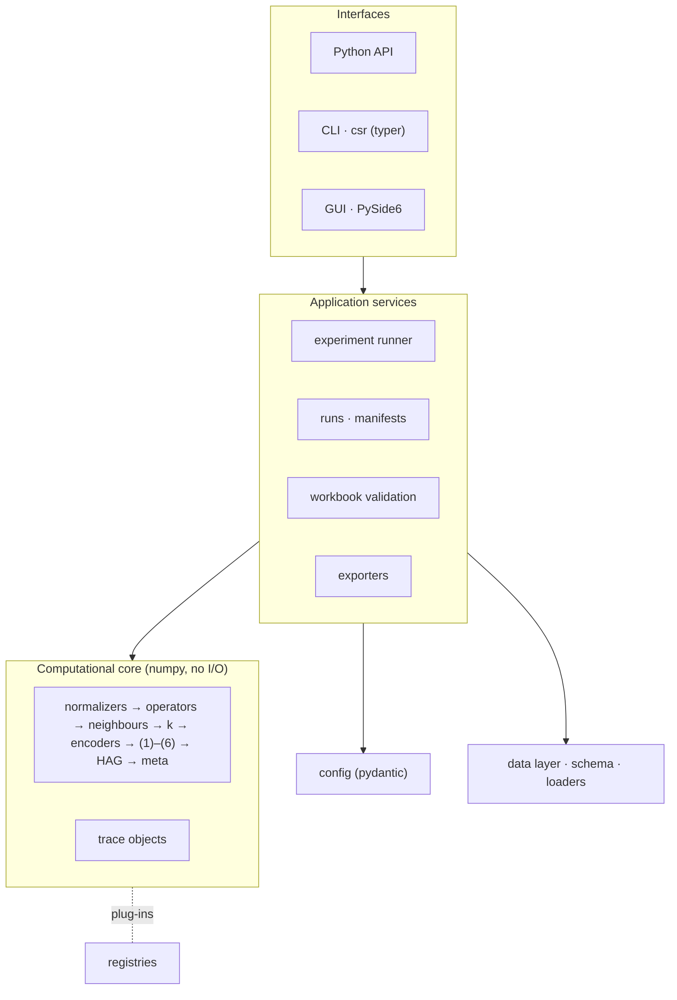
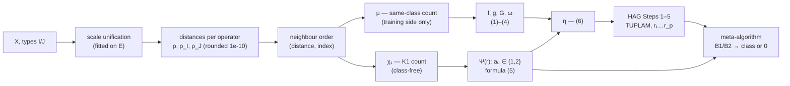
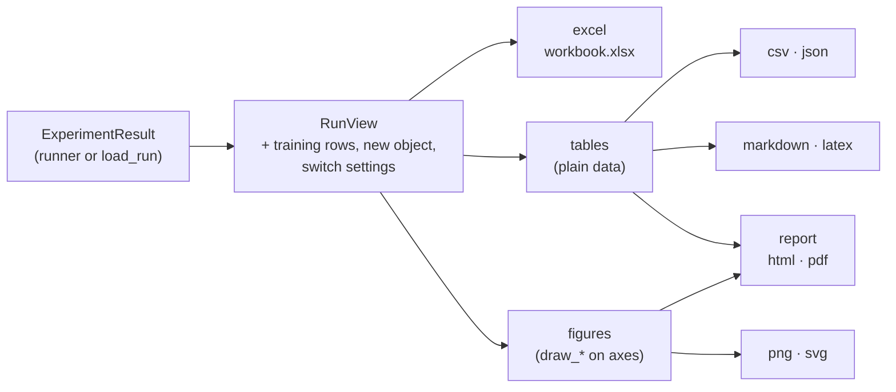
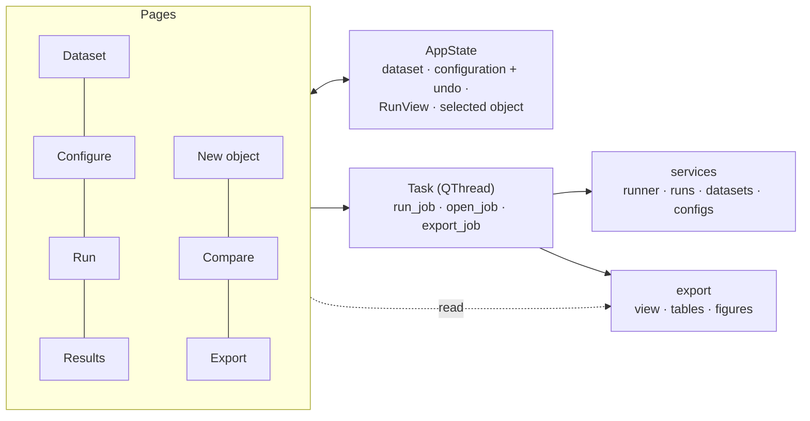

# Architecture

## Layers

The computational core is pure and deterministic; everything that touches files, users or screens
sits above it. The CLI and the GUI call the same services.

| Package | Role | Status |
|---|---|---|
| `core` | Numerical pipeline, plug-in registries, trace objects, model properties | registry ✓ (M1), Steps 1–8 + trace ✓ (M2), HAG, meta-algorithm, model ✓ (M3), properties ✓ (M4), more metrics and normalizers ✓ (M7) |
| `config` | Typed configuration, presets, the two switches, YAML/TOML/JSON, hash | ✓ M1 |
| `data` | Dataset schema, loaders (workbook, template CSV/DAT, CSV/XLSX/Parquet), built-in datasets, hashing | ✓ M2 |
| `evaluation` | Protocols, metrics, AUC/ROC, margins, baselines | ✓ M4 |
| `services` | Runs and manifests, validation against the workbook and the templates, dataset summaries, experiment runner, run folders that can be repeated, switch sensitivity, configuration checks | ✓ M1 → M5 |
| `export` | Excel mirror, CSV/JSON, LaTeX/Markdown, figures, report | ✓ M5 |
| `cli` | `csr` command | `config` ✓ (M1), `data`, `validate` ✓ (M2), `fit`, `classify` ✓ (M3), `run` ✓ (M4), `export` ✓ (M5), `gui` ✓ (M6) |
| `gui` | Desktop application (PySide6, optional extra `[gui]`) | ✓ M6 |

## Pipeline and information flow

The class of an object enters only through μ, which feeds the training-side formulas (1)–(4). A new
object reaches the meta-algorithm through χ₁ and formula (5) alone (Theorem, ADR-009): its class
is not an argument of `represent` or `predict`.

## Trace objects

Every intermediate table the workbook shows — normalized data, distance and rank matrices,
neighbour blocks with μ and χ₁, Ψ(r), f/g, ω, η, each HAG iteration with every candidate's b,
centres, θ, γ and θ/γ, the meta-algorithm's B1/B2 per step, margins and metrics — is captured as
immutable data. The GUI tables, the exporters and the golden tests read the same trace, so the
workbook, the software and the article's tables cannot drift apart.

## Exporters

`export.view.RunView` is the one thing every exporter reads: the evaluated experiment with
every training object classified, the new-object demonstration and — when evaluated — the four
switch settings. `export.tables` turns it into plain tables that the text formats and the report
share; `export.excel` lays it out as the mirror of the experiment workbook (sheet builders in
`sheets_*.py`, a palette of named styles, a writer that detects overlapping tables);
`export.figures` draws on axes it is given, so the GUI reuses the drawings; `export.report`
arranges tables and figures into a document and renders it as HTML and PDF. Formats are plug-ins
of the `EXPORTERS` registry ([Exporting](exporting.md), ADR-036 – ADR-043).

## Desktop application

The package `gui` adds no computation. Pages change the shared `AppState` and listen to its
signals; a run, the opening of a saved run and an export are plain functions over the services,
run in a worker thread; tables and figures are the exporters' own, shown through a Qt model that
adds the workbook's colour semantics. Plug-in parameter forms are generated from the parameter
types ([Desktop application](gui.md), ADR-044 – ADR-048).

## Extension points

Every exchangeable part is a plug-in chosen by name. The table lists what is built in; the last
column names what the design leaves room for but does not ship.

| Kind | Default | Also built in | Not built in |
|---|---|---|---|
| metrics | Zhuravlyov on all / I / J | weighted Zhuravlyov, HEOM, Gower; Manhattan, Euclidean, Chebyshev, Minkowski, Canberra, cosine, Mahalanobis on I; Hamming on J (ADR-050, ADR-051) | HVDM — it reads class labels (ADR-051) |
| normalizers | min–max (training data) | none, z-score, robust, max-abs, decimal scaling, rank, unit length (ADR-052) | — |
| k strategies | formula (ADR-005/006) | article rule, explicit list, range (ADR-022) | — |
| encoders | formula (5) | — | μ and bit masks are training-side gradations, not encoders (ADR-021) |
| weights | ω by (4) | — | the template's Criterion-1 and λ·β weights |
| majorizers | logistic sigmoid | tanh, arctan, softsign, scaled to (0, 1) (ADR-026) | — |
| decision rules | article Step 4 (refusal = 0) | — | — |
| protocols | resubstitution, leave-one-out | stratified k-fold, repeated k-fold, hold-out (ADR-032) | nested cross-validation |
| baselines | k-NN vote | scikit-learn classifiers (extra `[sklearn]`, ADR-032) | — |
| dataset formats | detected from the file | experiment workbook, extended layout, CSV, Excel, Parquet (ADR-018) | — |
| export formats | all | Excel mirror, CSV, JSON, Markdown, LaTeX, figures, HTML, PDF (ADR-036 – ADR-043) | — |

Plug-ins register by name in a `Registry`; external packages add them through the entry-point
group `context_synthetic_recognition.<kind>` ([Extending](extending.md)).
