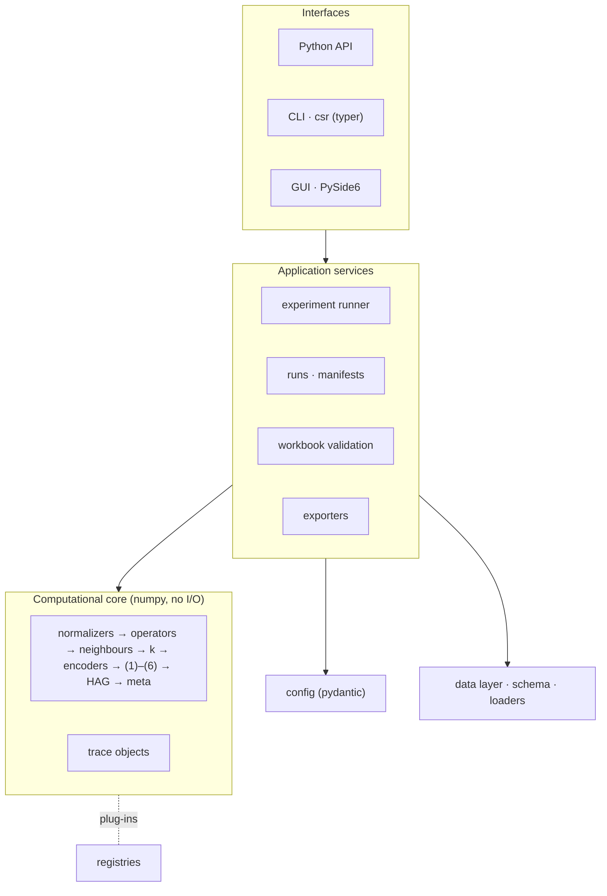
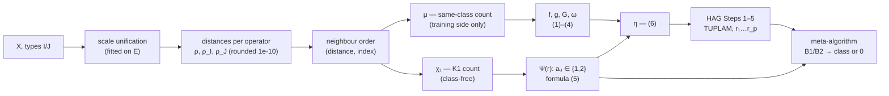

# Architecture

## Layers

The computational core is pure and deterministic; everything that touches files, users or screens
sits above it. The CLI and the GUI call the same services.

| Package | Role | Status |
|---|---|---|
| `core` | Numerical pipeline, plug-in registries, trace objects, model properties | registry ✓ (M1), Steps 1–8 + trace ✓ (M2), HAG, meta-algorithm, model ✓ (M3), properties ✓ (M4) |
| `config` | Typed configuration, presets, the two switches, YAML/TOML/JSON, hash | ✓ M1 |
| `data` | Dataset schema, loaders (workbook, template CSV/DAT, CSV/XLSX/Parquet), built-in datasets, hashing | ✓ M2 |
| `evaluation` | Protocols, metrics, AUC/ROC, margins, baselines | ✓ M4 |
| `services` | Runs and manifests, validation against the workbook and the templates, dataset summaries, experiment runner, switch sensitivity, configuration checks | ✓ M1 → M4 |
| `export` | Excel mirror, CSV/JSON, LaTeX/Markdown, figures, report | M5 |
| `cli` | `csr` command | `config` ✓ (M1), `data`, `validate` ✓ (M2), `fit`, `classify` ✓ (M3), `run` ✓ (M4) |
| `gui` | Desktop application | M6 |

## Pipeline and information flow

The class of an object enters only through μ, which feeds the training-side formulas (1)–(4). A new
object reaches the meta-algorithm through χ₁ and formula (5) alone (Theorem, ADR-009): its class
is not an argument of `represent` or `predict`.

## Trace objects

Every intermediate table the workbook shows — normalized data, distance and rank matrices,
neighbour blocks with μ and χ₁, Ψ(r), f/g, ω, η, each HAG iteration with every candidate's b,
centres, θ, γ and θ/γ, the meta-algorithm's B1/B2 per step, margins and metrics — is captured as
immutable data. The GUI tables, the exporters and the golden tests read the same trace, so the
workbook, the software and the article's tables cannot drift apart.

## Extension points

| Kind | Default | Planned alternatives |
|---|---|---|
| metrics | Zhuravlyov on all / I / J | HEOM, HVDM, Gower (ADR-011), then Euclidean, Manhattan, Chebyshev, Minkowski, Canberra, cosine, Mahalanobis, Hamming, weighted Zhuravlyov |
| normalizers | min–max (training data) | none ✓; z-score, robust, max-abs, decimal scaling, rank, unit length (M7) |
| k strategies | formula (ADR-005/006) | article rule, explicit list, range ✓ (ADR-022) |
| encoders | formula (5) | — (μ and bit masks are training-side gradations, ADR-021) |
| weights | ω by (4) | Criterion-1, λ·β (template) |
| majorizers | logistic sigmoid | tanh, arctan, softsign ✓ (scaled to (0, 1), ADR-026), custom |
| decision rules | article Step 4 (refusal = 0) ✓ | — |
| protocols | resubstitution, leave-one-out | stratified k-fold, repeated k-fold, hold-out ✓ (M4); nested CV |
| baselines | k-NN vote | scikit-learn classifiers ✓ (M4, extra `[sklearn]`) |

Plug-ins register by name in a `Registry`; external packages add them through the entry-point
group `context_synthetic_recognition.<kind>`.
