# Desktop application

The desktop application takes an experiment through the whole workflow — **Dataset → Configure →
Run → Results → New object → Compare → Export** — and shows every table and figure of the
workbook for any dataset. It computes nothing itself: a run is the same
`run_experiment` the command line uses, and the pages show the same tables and figures the
exporters write, so the screen, the Excel mirror and the article's tables cannot disagree.

```powershell
.\.venv\Scripts\python.exe -m pip install -e ".[gui]"     # PySide6 (included in ".[dev]")
.\.venv\Scripts\csr.exe gui                               # the project's default dataset
.\.venv\Scripts\csr.exe gui heart-disease-270 -c configs\heart-disease-270-large-data.yaml
.\.venv\Scripts\csr.exe gui --run runs\20261001_120000_5a0c7b92   # open a saved run
.\.venv\Scripts\csr-gui.exe                               # the same, without a console window
```

**Without Python.** Each release has a Windows build, `csr-gui-<version>-windows.zip`
([Releases](https://github.com/ktuhtabayev/context-synthetic-recognition/releases)): unpack it
anywhere and start `csr-gui.exe` — nothing is installed. The built-in Heart-Disease datasets are
included; your own datasets are opened from their files. Two optional extras are not part of the
build — Parquet files and the scikit-learn baselines — and the application says so when one is
asked for. `csr-gui.exe --self-test report.txt` checks an installation without showing a window:
it loads every language, runs the default experiment, draws a table and a figure, exports the
run and writes what it found to the report (exit code 0 = everything works).

!!! warning "Two template calculations differ from the article"
    The application never lets them out of sight: a ⚠ badge in the status bar (click it to see the
    switches), a warning box at the top of *Configure*, a ⚠ mark beside each switch, the ⚠ rows of
    *Compare*, and the *Switch sensitivity* table and figure of the results. The default is the
    template calculation, which reproduces the workbooks exactly; **Edit → Article preset** follows
    the article. See [DECISIONS.md](DECISIONS.md) (ADR-002 – ADR-004).

## 1 · Dataset

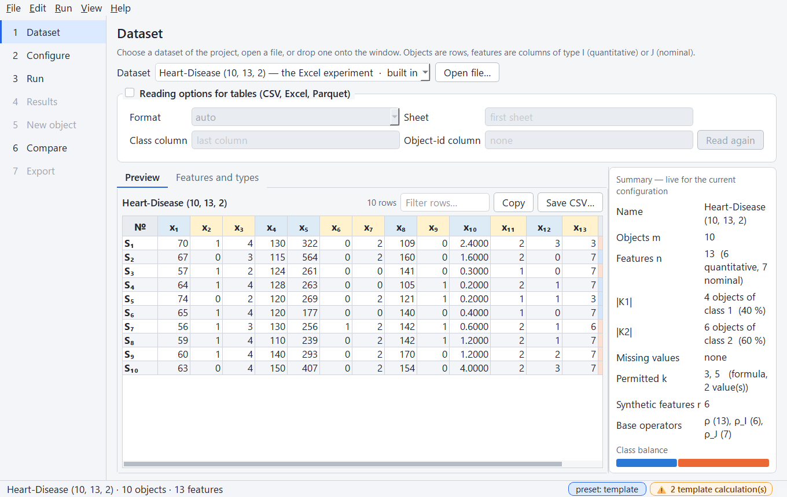

Choose a dataset of the project's `datasets` folder or a built-in one, open a file
(**Ctrl+O**), or drop a file onto the window. The preview shows objects × features; the header of
a column is blue for a quantitative feature (set I) and yellow for a nominal one (set J), the
class column is tinted by class.

- **Features and types** — the type of every feature decides how it enters the distance. Change
  it in the *Type* column; the dataset is read again and the summary updates.
- **Reading options** — for tables (CSV, Excel, Parquet): the format, the sheet, the class column
  (default: the last column) and an optional object-id column, then *Read again*. A dataset with
  missing values is not loaded; the message names the cells.
- **Summary** — live for the current configuration: |K1| and |K2|, the class balance, the
  permitted k and r = |Ψ(r)|. If the model would be undefined for the data (no permitted k, more
  than two classes), the summary says why.

## 2 · Configure

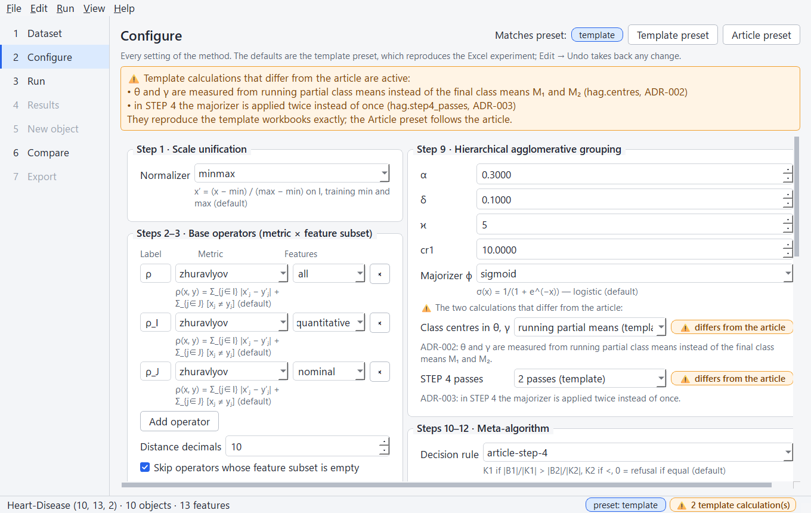

Every setting of the method, grouped by the steps of the pipeline. Plug-ins — normalizer, metric,
k rule, encoder, weights, majorizer, decision rule, protocols, baselines — are chosen from their
registries, and each plug-in's parameters appear as a form generated from its parameter type, so a
plug-in added to a registry shows up here by itself.

- **Presets** — *Template preset* and *Article preset* set the method; the dataset, the name and
  the seed stay. The badge at the top says which preset the configuration matches.
- **Base operators** — a label, a metric and a feature subset each: `all`, `quantitative`,
  `nominal`, or feature names separated by commas. Labels must be unique. A metric defined on
  quantitative features (Euclidean, Mahalanobis, …) or on nominal ones (Hamming) must get a
  subset of that type; otherwise the problem list names the features that do not fit.
- **Permitted k** — the rule and, live, the k it gives for the loaded dataset and the resulting
  number of synthetic features.
- **The two ⚠ switches** — *Class centres in θ, γ* and *STEP 4 passes*, each marked while it is at
  the template value.
- **Validation** — problems (an invalid parameter, a k rule that permits nothing, no protocol)
  are listed at the top and keep *Run* disabled.
- **Undo / redo** — every edit can be taken back (**Ctrl+Z**, **Ctrl+Y**).
- **Files** — **File → Open configuration…** (**Ctrl+Shift+O**) reads a YAML, TOML or JSON
  configuration and loads the dataset it names; **Save configuration as…** (**Ctrl+S**) writes
  one.

## 3 · Run

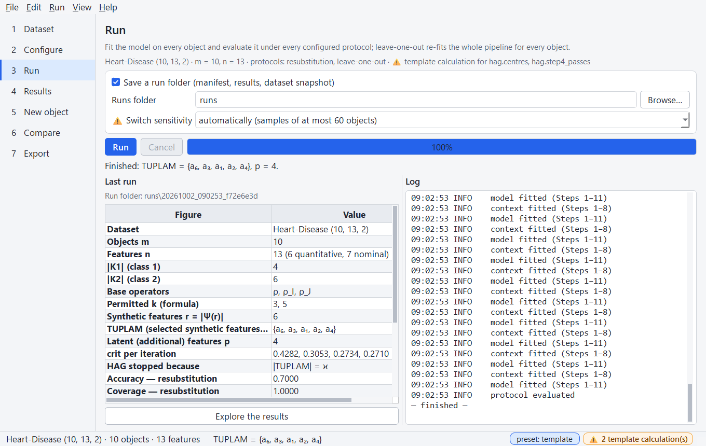

**Run** (**F5**) fits the model and evaluates it under every configured protocol in a background
thread: the window stays responsive, the progress bar follows the folds, the log shows what the
pipeline reports, and **Cancel** (**Shift+F5**) stops at the next fold.

- **Save a run folder** — writes `runs/<time>_<hash>/` with the manifest, the results and the
  dataset snapshot ([Evaluation](evaluation.md)); a saved run can be opened again and compared.
- **⚠ Switch sensitivity** — also evaluates all four settings of the two switches (a leave-one-out
  each): automatically for samples of at most 60 objects, always, or never.

When the configuration is edited after a run, the pages say that the results on screen belong to
another configuration until the experiment is run again.

## 4 · Results

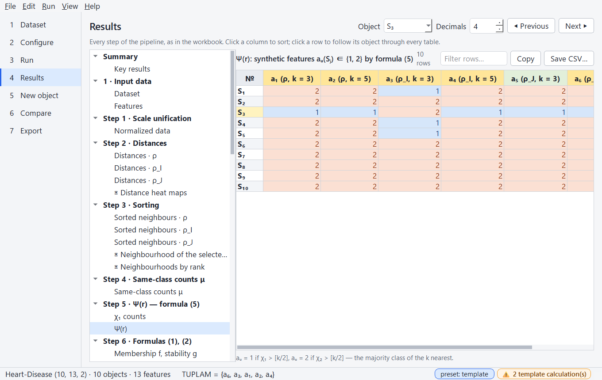

The steps of the workbook as a tree: every stage with its tables and, marked ▣, its figures.
**Previous** / **Next** (**Alt+←**, **Alt+→**) walk through them in order.

Tables use the workbook's colour semantics:

| Colour | Meaning |
|---|---|
| blue / yellow header | quantitative (I) / nominal (J) feature |
| light green header | synthetic feature aᵤ |
| yellow header or row | a feature of TUPLAM; the chosen candidate q of a HAG iteration |
| strong green header | latent feature r_j |
| blue / orange cell | class K1 / K2 — also aᵤ = 1 / aᵤ = 2, the class a neighbourhood votes for |
| green / red / grey cell | correct / wrong decision / refusal (0); ✓ / ✗ status |

- **Sorting** — click a column header (numbers sort numerically, S₁₀ after S₉); a table opens in
  pipeline order.
- **Formula tooltips** — a column header names what it holds and the article's formula
  ("Informativeness ω — formula (4)").
- **Cross-highlighting** — click a row, or choose an object in the *Object* selector: the object
  is marked in every table, and *Neighbourhood of the selected object* draws its neighbours with
  the nested k-neighbourhoods.
- **Filter, copy, save** — filter rows by text, copy the selected rows (**Ctrl+C**, pastes into
  Excel), save the table as CSV at full precision. *Decimals* changes only what is shown.

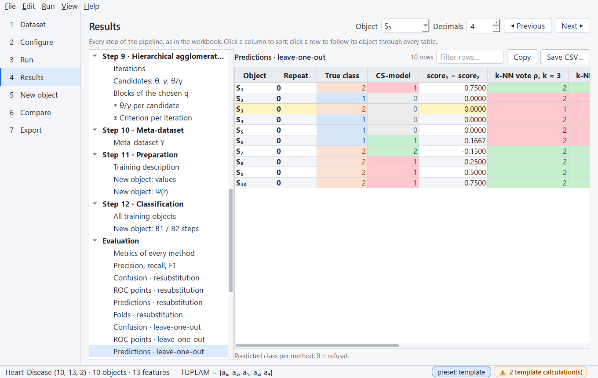

Figures are interactive (zoom, pan, the value under the cursor) and can be saved as PNG, SVG or
PDF at the export size.

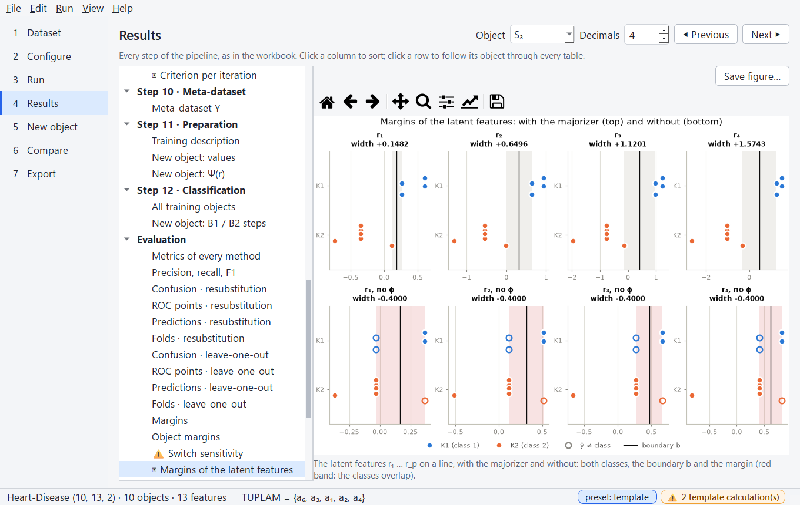

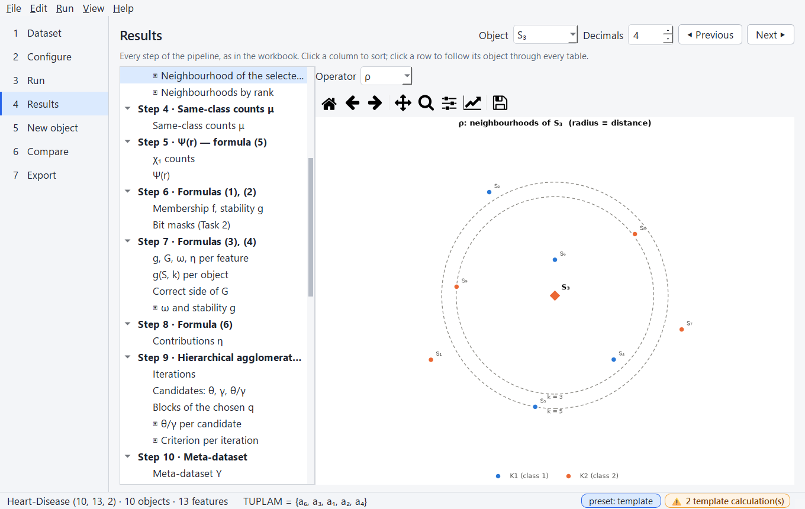

## 5 · New object

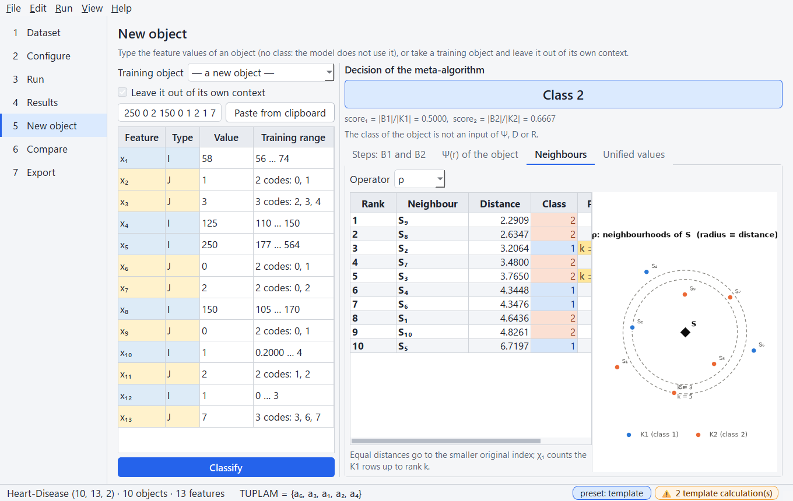

Type the feature values of an object — there is no class input: the model does not use it — or
paste a row (commas, semicolons, spaces or tabs), or take a training object. *Leave it out of its
own context* repeats the workbook's Theorem check: the object must get the representation and the
decision of its training row.

**Classify** shows the decision with score₁ and score₂ and explains it: B1 and B2 at every step
of the meta-algorithm, the object's Ψ(r) with χ₁ and χ₂, its neighbours under every operator with
the permitted k marked, and its unified values. The classified object also becomes the object of
the *New object* tables of the results and of the exports.

## 6 · Compare

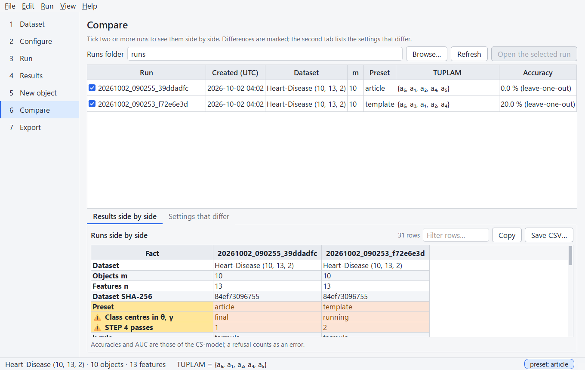

The runs of the runs folder, newest first (a result that was not saved is listed as *current*).
Tick two or more: the key facts appear side by side with the differing rows marked, and *Settings
that differ* lists the configuration settings that are not the same. *Open the selected run*
repeats a run from its folder and shows all its tables and figures.

## 7 · Export

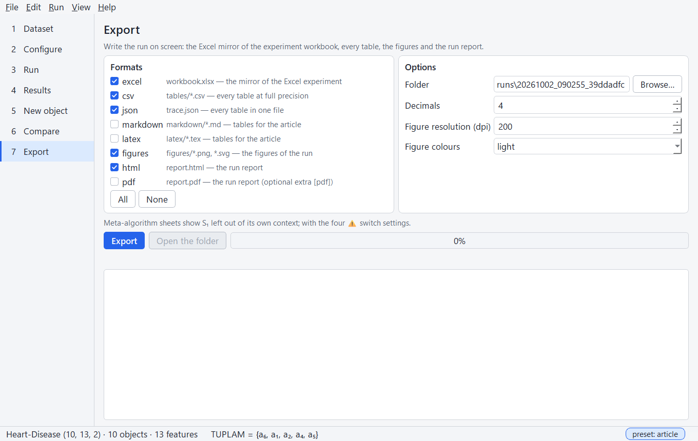

Writes the run on screen in the ticked formats — the Excel mirror, CSV, JSON, Markdown, LaTeX,
figures, the HTML and PDF report ([Exporting](exporting.md)) — into the run folder (or a folder of
your choice) in the background, and lists what was written and what was left out because of its
size.

## Appearance and what is remembered

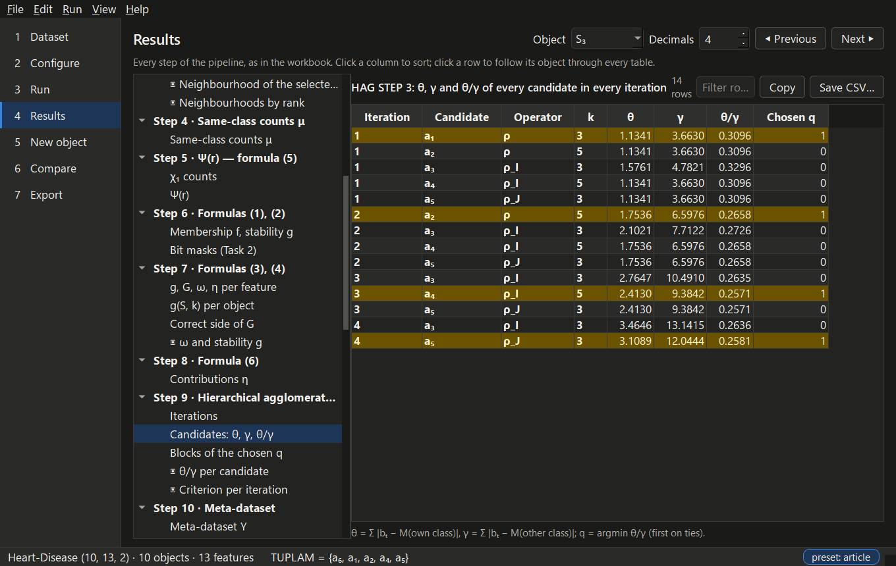

- **View → Light theme / Dark theme** (**Ctrl+T**); tables and figures follow.
- **View → Zoom in / Zoom out / Actual size** (**Ctrl++**, **Ctrl+−**, **Ctrl+0**) scales the
  whole interface.
- The window size, the theme, the zoom, the language, the runs folder and the recent datasets,
  configurations and runs (**File → Recent …**) are remembered between sessions.
- The colours of the classes and of the figures are colour-blind safe. Correct / wrong use the
  workbook's green and red and are never the only cue: the predicted and the true class are both
  written, a refusal is the value 0, and statuses carry ✓ / ✗ / ⚠.

## Language

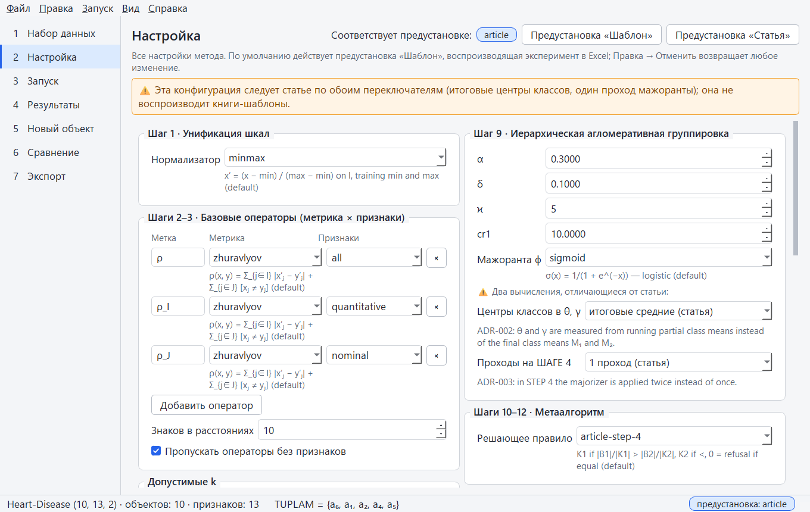

**View → Language** offers *System language*, English, Русский and Oʻzbekcha (Latin script). The
window changes at once and keeps what you are working on — the dataset, the configuration with
its undo history, the run and the selected object; the choice is remembered. *System language*
follows the language of Windows and falls back to English. While a run or an export is in
progress the language stays as it is.

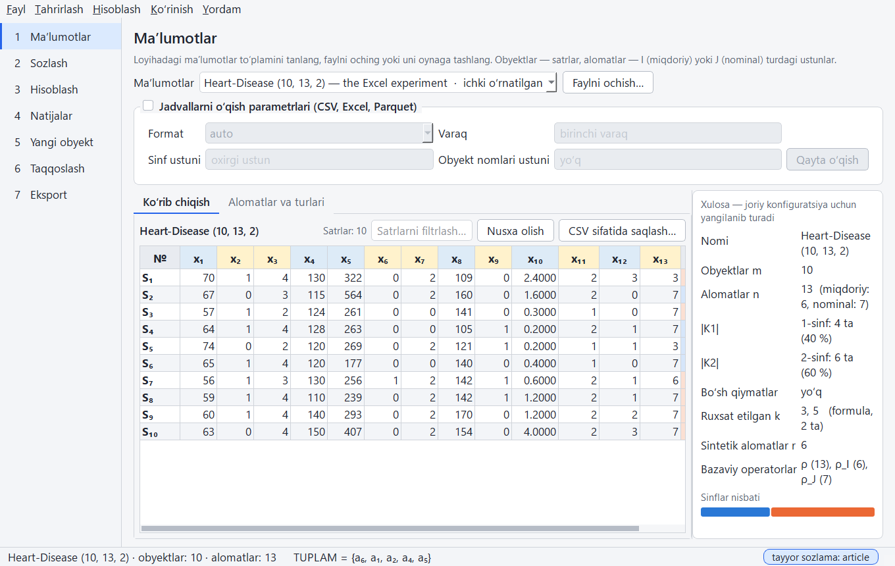

Only the interface is translated — menus, pages, buttons, forms, messages. What the exporters
produce stays in English, in the application too: the tables and figures of *Results*, the
explanation on *New object*, and every exported file. The names of plug-ins and their formulas
(`minmax`, `zhuravlyov`, …) are the names used in configuration files and are not translated
either (ADR-054).

## Keyboard shortcuts

| Keys | Action |
|---|---|
| Ctrl+O | Open a dataset |
| Ctrl+Shift+O | Open a configuration |
| Ctrl+S | Save the configuration |
| Ctrl+Shift+R | Open a run folder |
| F5 | Run the experiment |
| Shift+F5 | Cancel the run |
| Ctrl+E | Export |
| Ctrl+Z / Ctrl+Y | Undo / redo a change of the configuration |
| Ctrl+1 … Ctrl+7 | Go to a page |
| Alt+← / Alt+→ | Previous / next table or figure of the results |
| Ctrl+C | Copy the selected table rows |
| Ctrl+T | Switch between the light and the dark theme |
| Ctrl++ / Ctrl+− / Ctrl+0 | Zoom in / out / reset |
| F1 | Keyboard shortcuts |
| Ctrl+Q | Quit |

## For developers

The package `gui` is one more interface above the services ([Architecture](architecture.md)):

- `state.AppState` — the dataset, the configuration (with its undo stack), the run on screen and
  the selected object; pages talk only through it.
- `workers` — `run_job`, `open_job` and `export_job` are plain functions over the services; a
  `Task` runs one in a thread and reports through signals.
- `models`, `widgets`, `canvas` — the exporters' tables as a Qt model with the colour semantics;
  the table and figure panels.
- `forms` — parameter forms generated from the plug-ins' parameter types.
- `theme` — one palette per theme for the style sheet, the cell colours and the figures.
- `i18n` — every string passes through `tr()`; a constant shown later (a page title) is marked
  with `mark()`. The translations are `gui/translations/csr_ru.ts` and `csr_uz.ts`, compiled into
  the `.qm` files the application loads; `scripts\update_translations.py` keeps them in step with
  the code and the tests fail if a text is missing ([Development](development.md#translations)).
  Changing the language rebuilds the window on the same `AppState` (`app.rebuild_window`).

The screenshots of this page are made by `scripts\gui_screenshots.py`, which drives the real
application; the tests (`pytest -m gui`) drive it the same way without a display.
